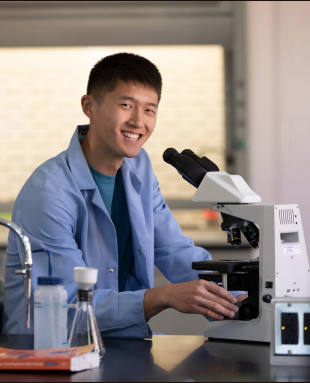
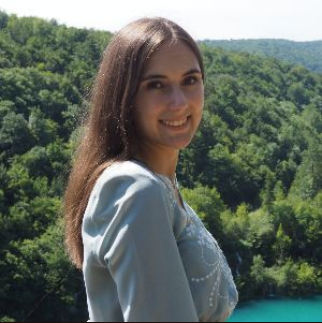
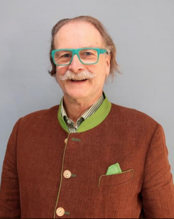

# User Research
We have opted for user interviews as user research. We chose to do partly standarized interviews. On this way we could provide the context for our questions and use the interviews to refine our hypotheses. If we did completly free interviews we would get a lot of data that we need to process. Partly standarized interviews help us to filter the information we gather more easily and spent less time to organize heterogenous data.

## Hypotheses
1. Users want all information in one app and not from different sources --> currently its very hard to keep up with multiple channels where information gets spread (mail, messagers, on-site, etc.)

2. Users want pictures of the drinks --> some of the items are pretty exotic and not everybody knows what to expect behind some item names. Prime example for this is the cortado, which is a smaller cappucchino, that needs to be explained to the customer often.

3. Users want descriptions (ingredients, allergies, vegan) of the drinks and snacks --> many customers of the InfoTreff follow special diets or have allergies, so they often ask if an item contains things which they want to avoid (e.g. lactose, gluten, animal products, etc.).

4. Users want to be informed about events --> after an event occured at the FBI people go to the café crew and tell them they weren't there because they didn't get the information for the event.

5. Users want to save the events directly in the calendar --> sometimes someone wanted to attend an event but forgot to come because he or she didn't save it to his calender manually.

6. Users would like to have the opportunity to give feedback --> people often make suggestions for new items or have questions regarding the offerings in the InfoTreff café.

## Questions for user interviews
#### Introduction

User interviews are conducted to gather feedback for the development of the Infotreff-Café app. The purpose of this interview is to obtain detailed insights from users regarding their experiences at Infotreff-Café, their opinion of our design ideas, and their preferences in terms of app features and information dissemination. The questions have been designed to explore various aspects of user interaction with the café, ranging from frequency of visits and menu choices to opinions on potential app functionalities like event overviews and social features, thereby guiding the development of a user-centric café app.

1. How often do you visit the Infotreff-Café and what do you usually order?
    - This question provides us with extra information on the interviewee, that we can use to weight the questions that follow
2. Which offers do you know in the Infotreff Café?
    - Related to hypotheses 1. We get a feeling of how good the current information flow is and if people always order the same items when they visit the café. 
3. How do you find out about the offers in the restaurants or cafés?
    - Related to hypotheses 1. We want to know the classic sources on which people get information from cafés. With the answers to this question we get an idea on which part of the app we should focus.
4. What is your experience with the current presentation of the offer?
    - Related to hypotheses 1 and 2. If the current presentation is accepted by the users we can base our design on the on-site presentation. None of the hot drinks have pictures on-site, so this question might provide information regarding pictures for hot drinks.
5. What information about the ingredients would be important to you?
    - Related to hypotheses 3. We want to know which information is relevant to users. This way we know that we aren't missing any of the custom needs of the users. This question is also very relevant because we might find some special diets that we would have forgotten.
6. How would detailed descriptions and pictures of the drinks and snacks influence your purchase decision?
    - Related to hypotheses 2 and 3. We want to know how much information a user wants for an item. We don't want to force information onto a user and most importantly don't want to influence them with our app.
7. What do you think of an overview for events?
    - Related to hypotheses 4. We want to get more information on the acceptance for the event feature. Events are poorly displayed at the FBI right now and we want to improve this with this feature. If people don't want a feature in this app we have to scrap this part and move on without it.
8. Would you like to be able to integrate events into your calendar?
    - Related to hypotheses 5. Is our hypotheses correct and do people actually want to add events to their calendar
9. Would you like to be able to share events with others? 
    - In a addition to hypotheses 5 we want to know if people want to share events with others without having to take a screenshot
10. Would you use such an application as an app or via the web?
    - Not related to any hypotheses. We want our design to fit the prefered type of app usage
11. Would social features, such as seeing which items are popular with students, influence your choice?
    - We don't want to influence our users with their purchases. If many people answer they will be influenced we will make viewing likes optional

## Results of the interviews

1. Average visit is 3 times per week, only one interviewee has never been to the Info-Treff-Café
2. Most interviewees know the offers pretty well regarding the menu, only some mentioned the events --> focus on events (?)
3. Most inform themselves through on-site resources or through online menu. 
   Only some inform themselves through emails and posters (regarding events) or directly through the café.
4. Most users are satisfied with the current presentation as they find the layout clear presented (can use it for orientation)
5. Currently most interviewees are interested in the allergens (such as lactose contents, vegan, vegetarian) and the ingredients. Some may be on a specific diet which may influence how they choose their meal. One specified wanting to know about the availability or scarcity of items on the menu
6. Most are unaffected by the pictures while making decisions. The feature will be used if it is available
7. Has a very positive feedback from interviewees, stating the feature is great
8. Has a very positive feedback from interviewees, stating the feature is great
9. Has a very positive feedback from interviewees, stating the feature is great
10. Mixed feedback from interviewees, some find it easier with an app, while others find the web app cooler. But the app on the phone has more vote compared to the web
11.  Most interviewees will be influenced especially while trying new things out. One mentioned that it would be great if able to see how many people are attending an event and a feature to state that they are attending the event (enable button for function)

## Project model 

We have decided in favour of Agile UX as a process model. We think it fits best with the approach we have planned for this semester, based on the lab exercises. In our opinion, Double Diamond is too powerful and large in its functions to be used effectively on our small scale. We also liked the Design Sprint approach, but we found the effort on the project and process management side too high.

## User Personas

{: height="150em" width="150em"}

**1. Frank Müller, an active student**

Age: 22

Background:
   Originates from a small town with beautiful nature
   Early fascination with the natural world influenced academic pursuits in biology

Academic Journey:
   Actively participates in lectures and laboratories at University
   Engages in extracurricular activities, such as a biology club, for a holistic university experience
   Demonstrates an inquisitive mind and commitment to academic excellence

Research Interest:
   Focuses on ecology and environmental biology
   Intrigued by the delicate balance of ecosystems and the impact of human activities on biodiversity
   Aspires to contribute to research addressing pressing environmental challenges

Lifestyle:
   Fitness enthusiast with a routine that includes regular workouts
   Avid nature photographer capturing the beauty of the environment
   Balances study sessions between the structured university library and a favorite local café

**User Story**

“As a student, I would like to know available snack from the cafeteria without go there, so that I can decide beforehand. I want to know the ingredient and the nutrient of the snack on the menu, so that I can manage my meal to benefit my workout routine. As a student, I also want to share event to my friend and add event detailed to my personal calendar, so that it’s easier to manage my time table and to invite more friend to the event”

{: height="150em" width="150em"}

**2. Sandra Rodriguez, vegan and a nutrition-conscious student**

Age: 23

Background:
   Grew up in a nature-centric small town.
   Instilled with environmental values by conscious parents.

Academic Journey:
   Pursuing a master's degree in Environmental Studies.
   Completed undergraduate studies in Environmental Science with honors.

Research Interests:
   Focus on sustainable agriculture, conservation, and the intersection of social justice and environmental issues.

Vegan Lifestyle:
   Adopted a vegan lifestyle during undergrad.
   Advocates for plant-based diets due to the environmental impact of animal agriculture.

Activism and Community Involvement:
   Active member of environmental and vegan advocacy groups on campus.
   Engages in community clean-up initiatives and organizes awareness events.

**User story** 

„As a vegan, I want to know if there is some available vegan option in the menu. I want to know if the calorie of the food is low for a more healthy diet. I also want to know if some event for vegan advocacy group are on the site”

{: height="150em" width="150em"}

**3. Konrad Ingram, an opinionated Professor**

Age:	47

Background:
   A seasoned software engineer with a passion for teaching and mentoring. 
   Holds a master's degree in computer science and has accumulated over a decade of experience in the tech industry. 
   Worked on a diverse range of projects, from developing cutting-edge software applications to contributing to open-source projects.

Workplace Persona:
   A respected figure both among his colleagues and the management. 
   Is adorned with a mix of coding references and motivational quotes, reflecting his dedication to both the craft and the community. 
   Likes to engage in discussions and is known to foster a culture of continuous learning within the workplace.

Cafeteria Gatherings:
   Enjoys building connections with his students outside the classroom setting. 
   Frequently organizes informal gatherings in the company cafeteria, where he invites students to join him for meals and coffee
   Provide an opportunity for students to ask questions, seek advice, or simply chat about the latest developments in the tech world.

Mealtime Conversations:
   Konrad often shares anecdotes from his own journey in software engineering, offering valuable   insights into the industry. 
   He encourages students to discuss their project and challenges. 
   Konrad believes that fostering a sense of community and mentorship is crucial for the growth of aspiring software engineers.

Coffee Corner:
   Has a favorite corner in the cafeteria where he likes to grab his daily dose of coffee. 
   Students know that if they want to catch him for a quick chat or advice, this is the place to find him. 
   Believes that good conversations often happen over a cup of coffee, and he enjoys creating a welcoming space for such interactions.

**User story**

“As a teacher, I want to arrage some event for my student, and have some mealtime conversation. I want to give the feedback of the caffee to the maker, so that it might improve in the future. “

