# Design

We started our design process by creating two Paper Prototypes independently of each other.
Both Prototypes aimed to create a design for a smartphone app, because the user Interview' result had shown slightly more interest in a phone app than a web app.

Regarding the menu part information about allergens and ingredients were very important for interviewees. Therefore both initial prototypes included an option to view more information about an item on the menu.

For the event calendar users gave very positive feedback about the share event function and the export date funktion. Also a feature to show how many people would attend an event came up during the interviews.
Therefore all three were incorporated into the design, along with the planned feature of a specials menu for each event.
 
## Prototype 1:  

{: height="50%" width="50%"}
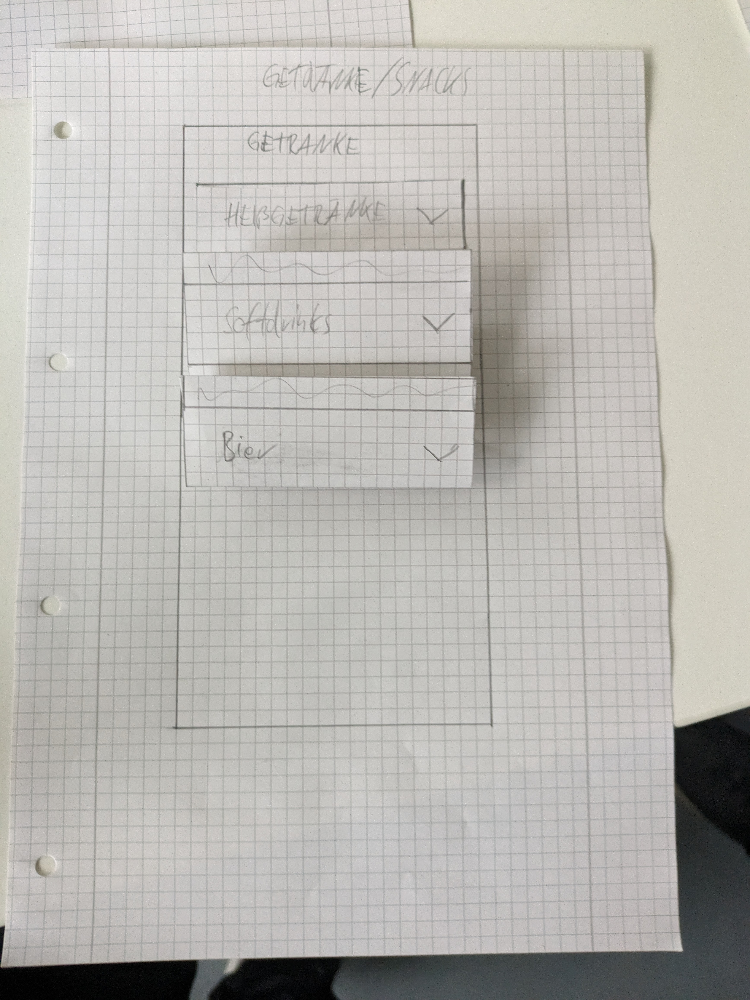{: height="50%" width="50%"}
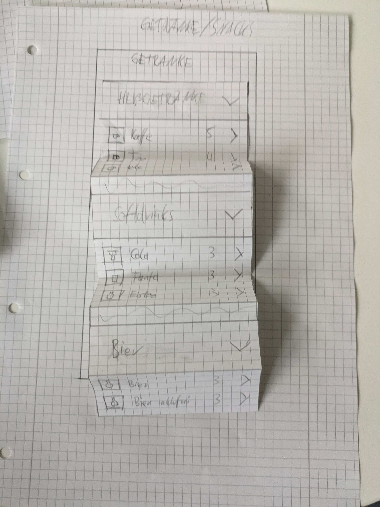{: height="50%" width="50%"}  
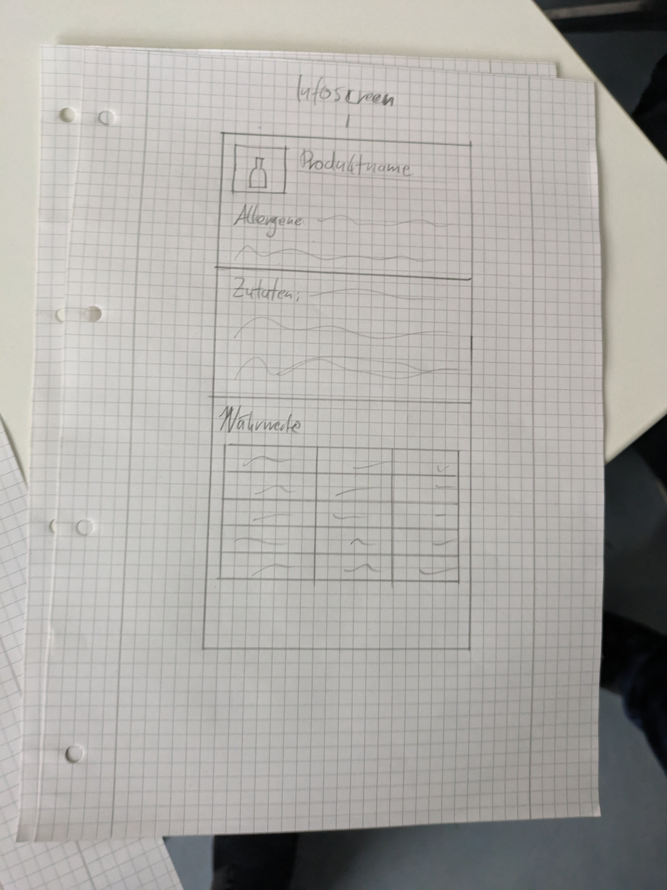{: height="50%" width="50%"}
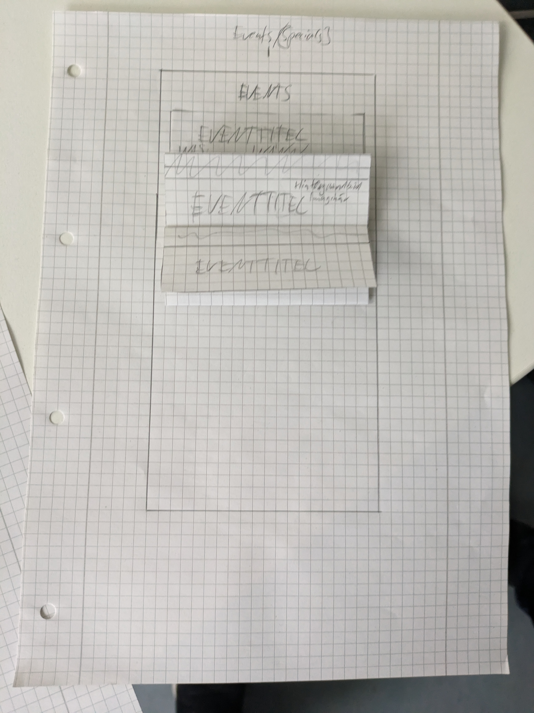{: height="50%" width="50%"}
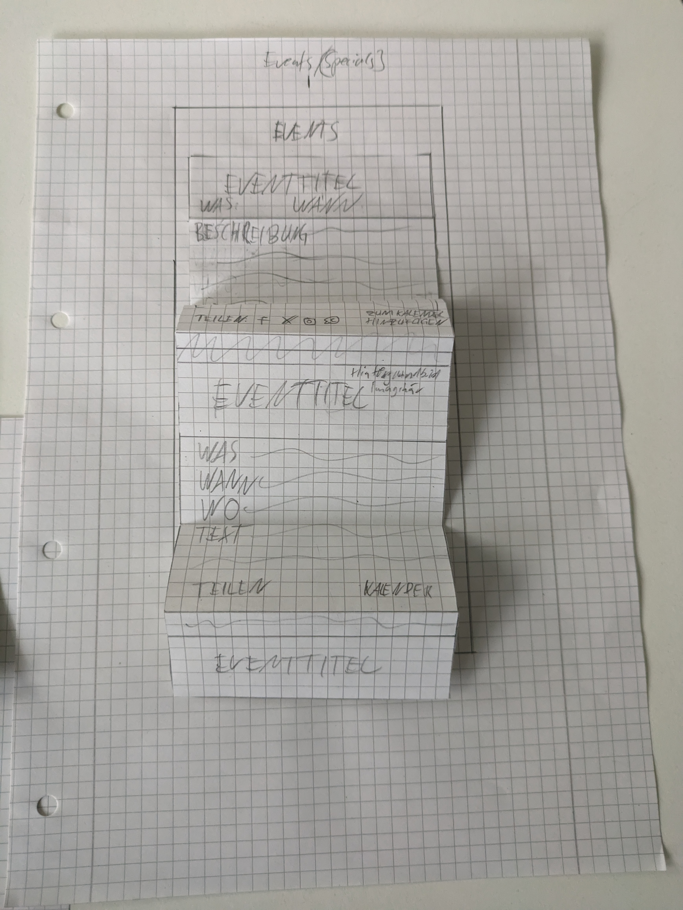{: height="50%" width="50%"}  

The first paper prototpe consisted of expandable tiles for the main information categories: events, specials, snacks and drinks.

These Categories contained lists of further expandable tiles, to show detailed information for an event or menu item.

## Prototype 2:  

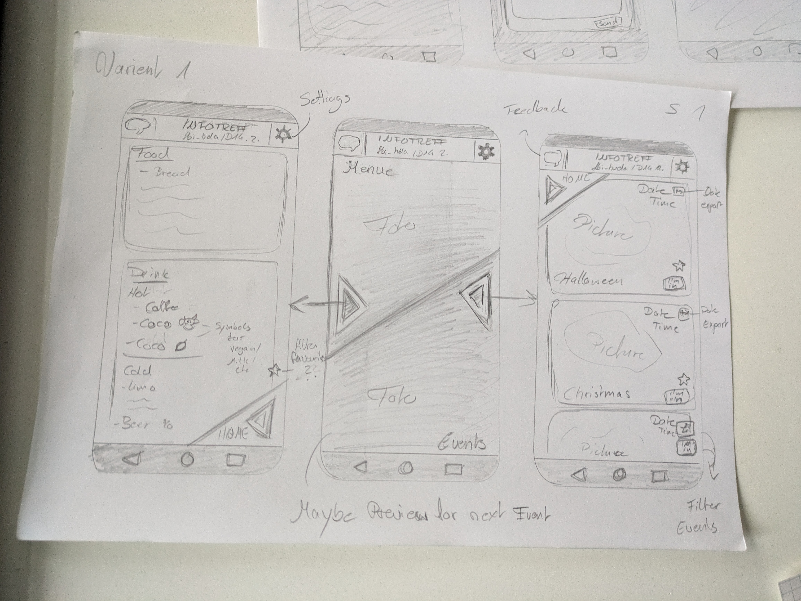{: height="50%" width="50%"}
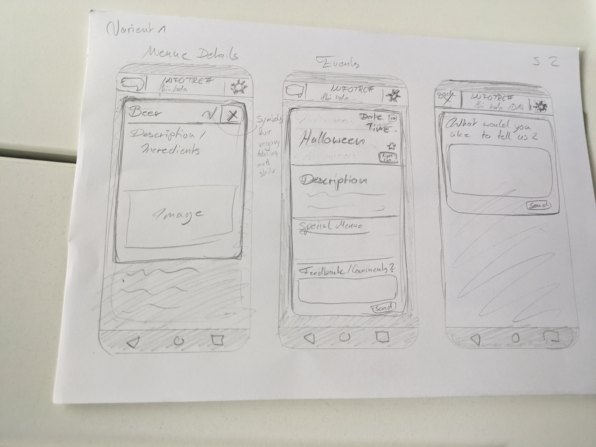{: height="50%" width="50%"}  

The second paper prototype contained a seperation between menu and event calander.

The menu contained a list of menu categories and items. Further information about a specific item was provided by a pop up.

The event calander was a list of Event cards, that contained all information and buttons, without an option to expand for further details.

The second paper prototype also contained an app bar at the top with settings, feedback and favorite options.
  
## Final Paper Prototype:  

After testing and discussing the two initial prototypes, we identified elements from both, that we wanted to keep.

From the first we kept the expandable lists and from the second the basic sreen layouts and navigation.

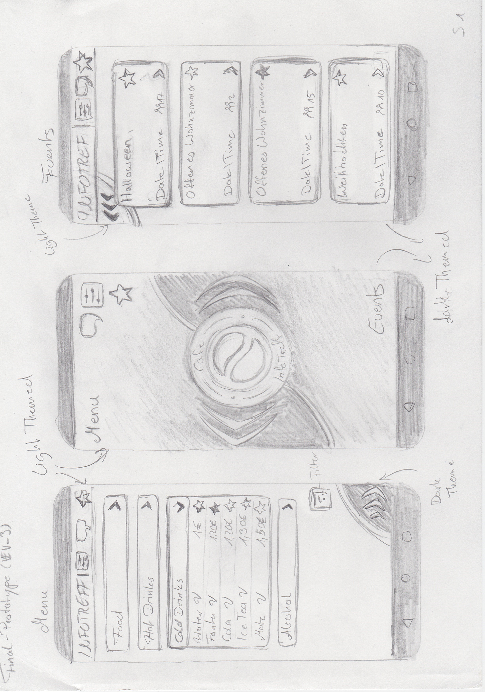{: height="50%" width="50%"}
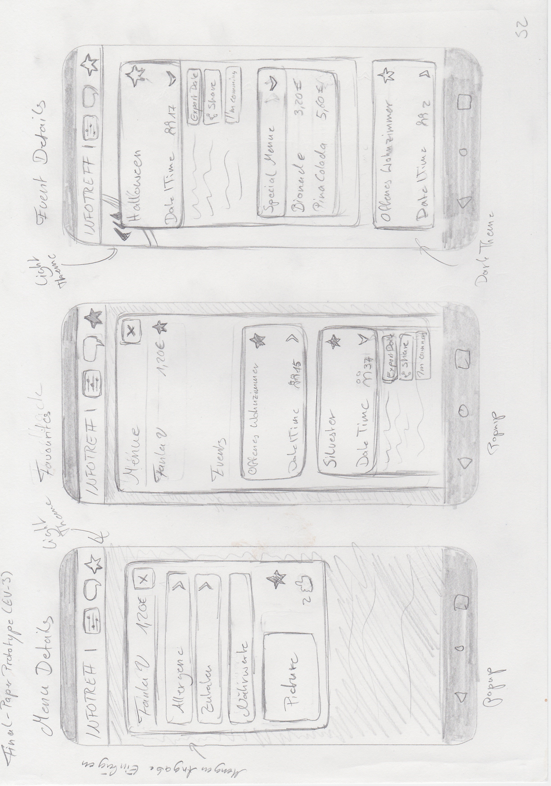{: height="50%" width="50%"}
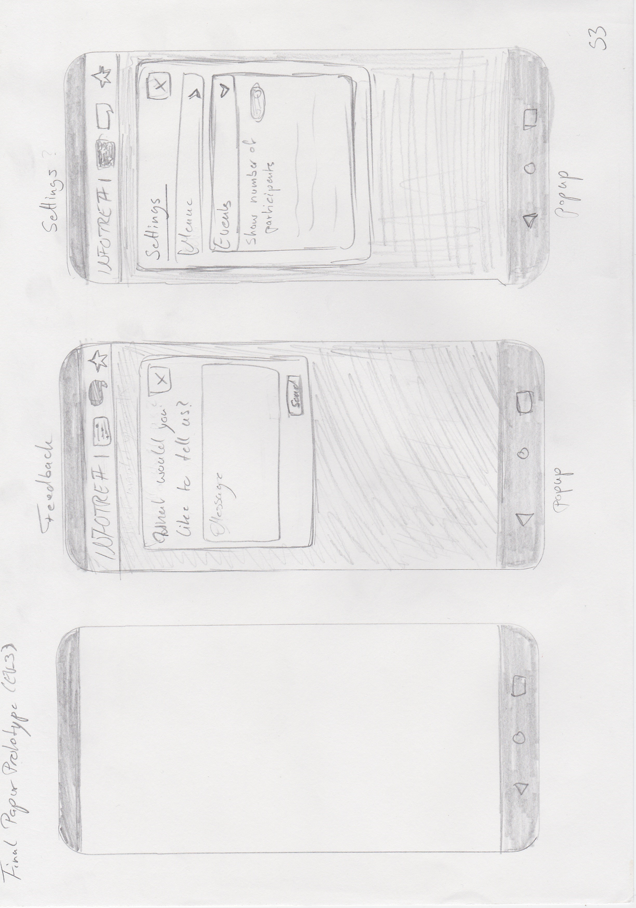{: height="50%" width="50%"}  

We also incorporated the InfoTreffs logo and aimed to match it with a more rounded and fluid design.

## Logo & Colours

We decided not to design a logo, but rather use the already existing logo of the InfoTreff Cafe and derived the colours for the app from it.

The app uses only four colours, the only exception being green for 'vegan' and 'vegetarian' labels. These four colors are light and dark primary colour and light and dark secondary colour.

During the creation of the Figma prototype the brightest colour derived from the logo, was adjusted slightly, to achive a better contrast ratio and readability.

The highest contrast ratio is 13.5 for the primary light against the primary dark colour.
The lowest contrast ratio is 3.26 the secondary light against the secondary dark, which is only used for some buttons.

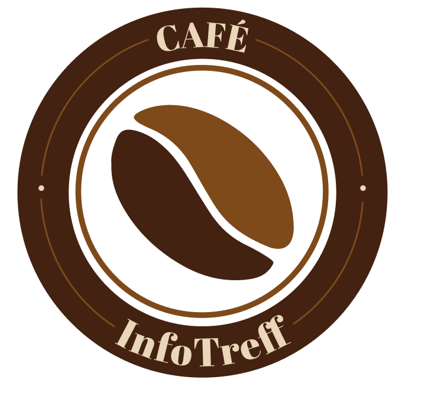{: height="50%" width="50%"}  
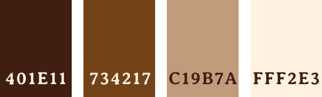{: height="100%" width="100%"}  

## Font  
The Font used in the figma prototype is Averia Serif Libre, which is available under an Open Font Licens.  
The Font has minor serifs and rounded edges and therefore pair well with the cafe's logo.  

The Font is mainly used with regular weight and in four sizes:  
- Headline 1: 30/bold
- Headline 2: 25/regular
- Text: 20/regular
- Menu Item: 16/regular

## Final Figma Prototype

At the end of the design process we used Figma to create an interactive prototype.

The prototype consists of 3 main screens and six pop-ups.

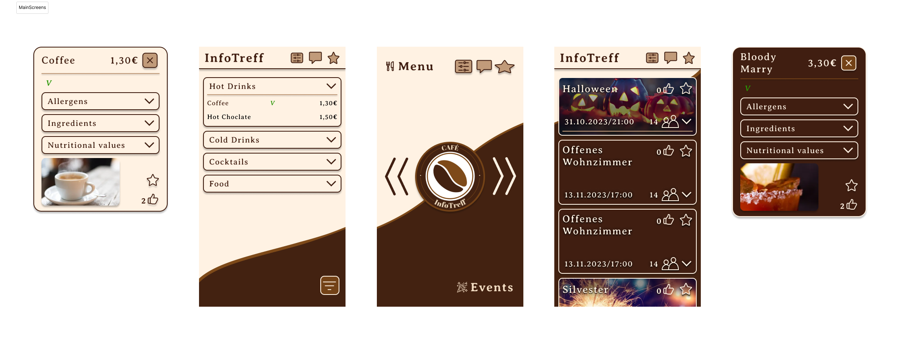{: height="100%" width="100%"}  

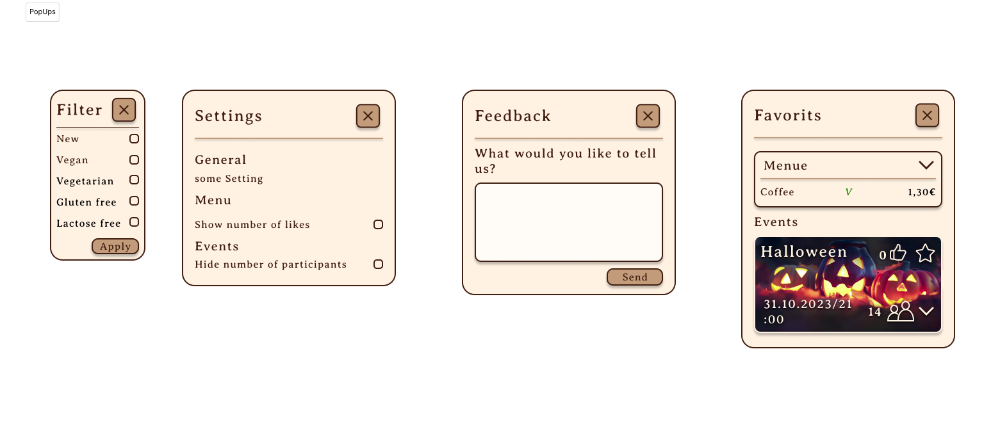{: height="100%" width="100%"}  

For interactive elements, like expandable lists or like buttons we created the folowing components.

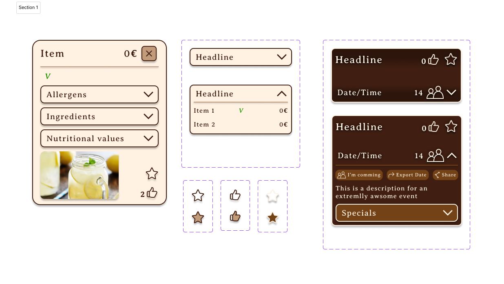{: height="100%" width="100%"}  

In order to test the design we used figma's prototyping feature to create a navigation shown in this user flow diagram:

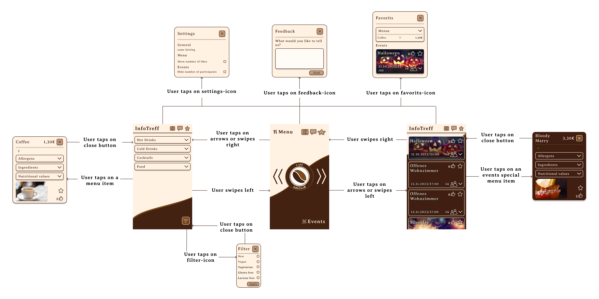{: height="100%" width="100%"}  

##Prototype 

You can experience the prototpe here [Prototype](https://www.figma.com/proto/jiCQyxJfKdGPFxwAN9XFMU/InfoTreffApp_Emil?node-id=3-7&scaling=scale-down&page-id=0%3A1&starting-point-node-id=1%3A2)
