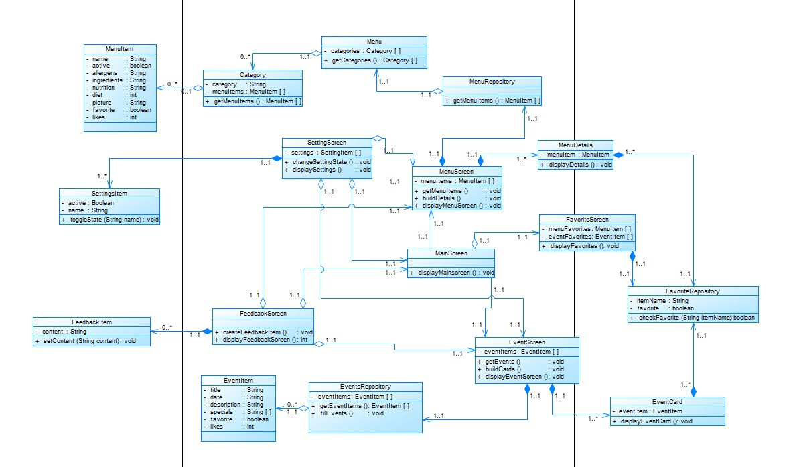

# Implementation

## Class diagram
The following class diagram shows the most important classes for our app:

## Interaction diagrams

### Event interactions 
The following picture displays the general sequence of interacting with events in our app:

### Menu interactions 
The following picture displays the general sequence of interacting with menu items in our app:

### Small interactions 
The following picture displays the general sequence of interacting with the favorite, settings and feedback feature in our app:

